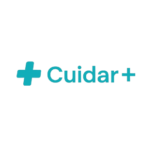

# CuidarPlus

 

## 📋 Sobre o Projeto

O CuidarPlus é uma plataforma completa para gestão de pacientes e cuidados de saúde, desenvolvida com Angular 19.2.5. Nossa missão é facilitar o dia a dia de profissionais de saúde, oferecendo uma interface intuitiva e moderna para gerenciar pacientes, medicamentos, e acompanhamentos clínicos.

## ✨ Principais Funcionalidades

- **Gestão de Pacientes**: Cadastre, visualize e acompanhe informações completas dos pacientes
- **Farmácia**: Controle de medicamentos e prescrições
- **Relatórios**: Visualize métricas e estatísticas importantes
- **Configurações Personalizáveis**: Adapte o sistema às suas necessidades

## 🛠️ Tecnologias Utilizadas

- **Framework Frontend**: Angular 19.2.5
- **UI/UX**: Bootstrap 5.3.4 & Bootstrap Icons 1.11.3
- **Testes**: Jasmine & Karma
- **Containerização**: Docker

## 📁 Estrutura do Projeto

```
src/
├── app/
│   ├── core/         # Serviços e interceptadores globais
│   ├── features/     # Módulos de funcionalidades (pacientes, farmácia, etc.)
│   ├── layout/       # Componentes de layout (header, sidebar, footer)
│   ├── shared/       # Componentes, pipes e serviços reutilizáveis
├── assets/           # Recursos estáticos (imagens, ícones, etc.)
├── environments/     # Configurações de ambiente
```

### 🧩 Componentes Principais

Nosso sistema é construído com base em uma arquitetura de componentes modernos e reutilizáveis:

- **Componentes de Layout**:
  - Header com notificações e informações do usuário
  - Sidebar de navegação intuitiva
  - Footer responsivo

- **Componentes Compartilhados**:
  - `PacienteAvatarComponent`: Exibe avatares de pacientes com iniciais
  - `DateInputComponent`: Entrada de datas customizada
  - `AlertComponent`: Sistema de notificações animadas
  - `PaginacaoComponent`: Controle avançado de paginação

## 🚀 Como Começar

### Requisitos

- Node.js 18.x ou superior
- NPM 9.x ou superior
- Angular CLI 19.2.6 ou superior

### Instalação

1. Clone o repositório:
   ```bash
   git clone https://github.com/mateuscarlos/cuidar-plus.git
   cd cuidar-plus
   ```

2. Instale as dependências:
   ```bash
   npm install
   ```

3. Inicie o servidor de desenvolvimento:
   ```bash
   ng serve
   ```

4. Acesse no navegador:
   ```
   http://localhost:4200/
   ```

## 💻 Scripts Disponíveis

### Desenvolvimento

Inicie o servidor de desenvolvimento com:

```bash
ng serve
```

A aplicação recarregará automaticamente se você alterar qualquer arquivo fonte.

### Build

Para criar uma build de produção:

```bash
ng build
```

Os arquivos serão gerados no diretório `dist/`.

### Testes

Execute os testes unitários com:

```bash
ng test
```

Para testes end-to-end:

```bash
ng e2e
```

## 🧪 Desenvolvimento e Contribuição

### Geração de Componentes

O Angular CLI facilita a criação de novos componentes:

```bash
ng generate component nome-do-componente
```

Ou de forma abreviada:

```bash
ng g c nome-do-componente
```

Para outros tipos de elementos:

```bash
ng generate directive|pipe|service|class|guard|interface|enum|module nome
```

### Padrões de Código

- **TypeScript Estrito**: Use sempre tipos apropriados
- **Componentes Standalone**: Prefira a abordagem standalone para novos componentes
- **Reactive Forms**: Utilize formulários reativos para validação e manipulação de dados
- **Lazy Loading**: Implemente carregamento sob demanda para módulos grandes

## 🐳 Docker

Para ambientes containerizados, utilize:

```bash
# Construir a imagem
docker build -t cuidar-plus .

# Executar o container
docker run -p 80:80 cuidar-plus
```

## 📊 Arquitetura

### Serviços Principais

- **PacienteService**: Gerencia operações relacionadas aos pacientes
- **DateFormatterService**: Formatação e manipulação de datas
- **AcompanhamentoService**: Controle de acompanhamentos clínicos
- **NotificacaoService**: Sistema de notificações e alertas

### Design Responsivo

O CuidarPlus foi projetado para funcionar perfeitamente em dispositivos móveis e desktops, utilizando:

- Grid system do Bootstrap
- Media queries personalizadas
- DeviceDetectorService para otimizações específicas de dispositivos

## 🔮 Melhorias Planejadas

- Implantação de testes e2e
- Implementação de modo offline usando IndexedDB
- Expansão da cobertura de testes unitários
- Internacionalização (i18n)

## 📚 Recursos Adicionais

- [Documentação do Angular](https://angular.dev/)
- [Documentação do Bootstrap](https://getbootstrap.com/docs/5.3)
- [Documentação de Bootstrap Icons](https://icons.getbootstrap.com/)

## 📝 Licença

Este projeto está licenciado sob a [Licença MIT](LICENSE).

---

© 2025 CuidarPlus. Todos os direitos reservados.
